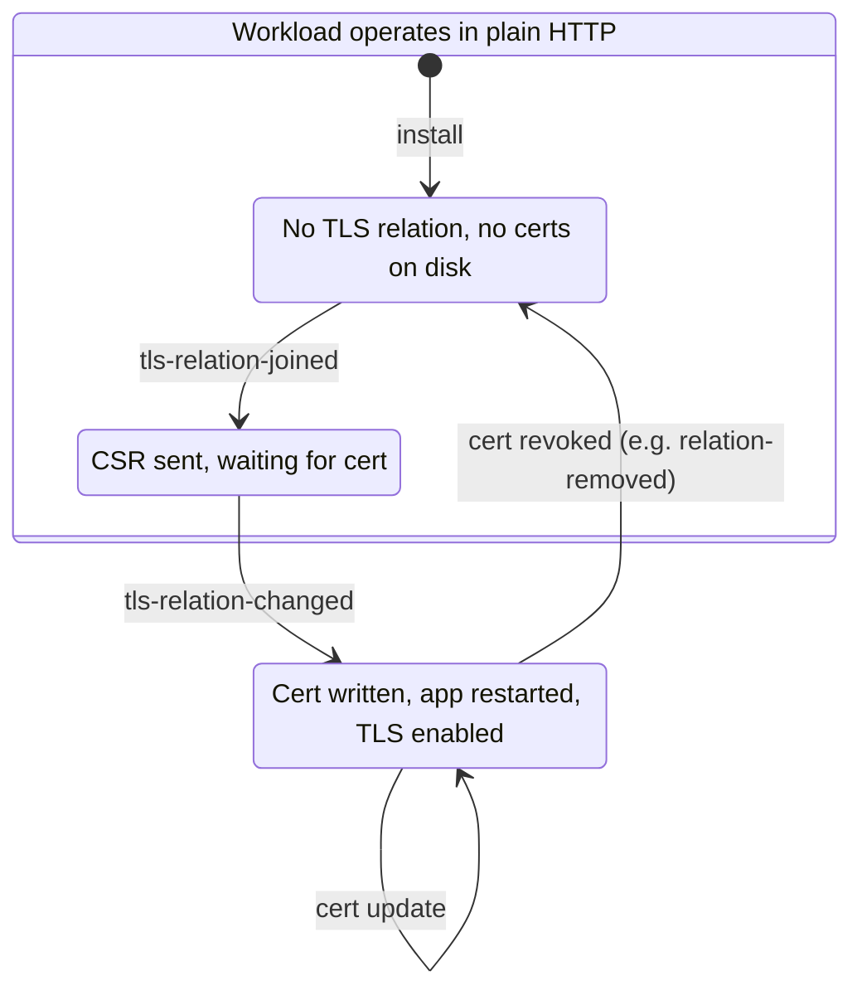

# Keep using plain http while waiting for cert

## Context and Problem Statement
When an admin forms a tls relation, there is a time window in which:

1. the juju model tells us we must operate with TLS enabled; however
2. we haven't received the server cert yet.

As a result we had some code ordering issues (e.g. #414):
- Should we update the config file with the tls config, which includes path to
  the cert, before we got the cert, only to perfectly reflect the juju model?
- Should we wait with the tls config and allow the workload to continue to
  operate in plain http, in contradiction to the juju model?
- How should we determine within the charm if "TLS is enabled"?

## Considered Options

- Stop operating in plain http mode as soon as a tls-certificates relation is
  formed.
- Continue operating in plain http mode until we get the certs.

## Decision Outcome

Chosen option: Continue operating in plain http mode until we get the cert.

We also distinguish between to substates:
- TLS enabled: we have a cert in relation data
- TLS active: the cert that is in relation data was written to disk and app
  config has a corresponding tls section.

### Consequences

* Good, because we won't incur data loss.
* Good, because loki is the receiver (server), and it should be up to the
  sender (client) to decide whether to send over plain http.
* Bad, because if the client is happy with both and cert takes a long time to
  arrive (or never arrives), then we have a model departure: admin wanted TLS,
  but we keep operating in plain HTTP.
